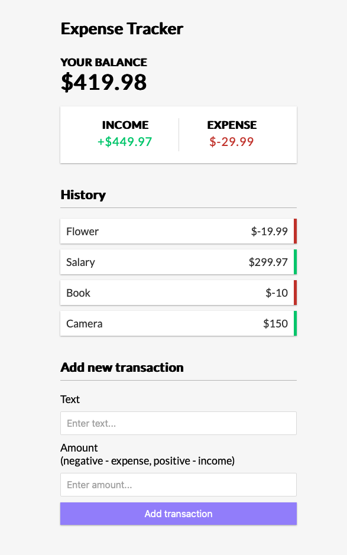

# An Expense Tracker Application built using VueJS

- This application is built using VueJS
- Uses Composition API in VueJS

## Running the application

### Running the frontend
- Run npm install
- To start the dev server, run npm run serve
- Open http://localhost:8080/ in a browser

## Technologies used
- VueJS

## App Screenshot

